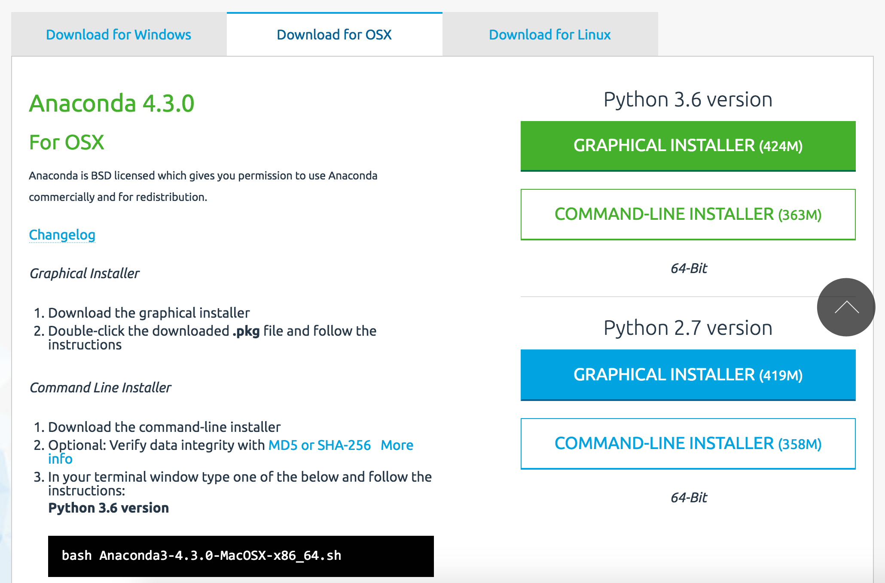

# Machine Learning Workshop
### By: Adam Li, Joseph Yu, Drew Breithaupt
### 3/7/17

The goal for this workshop is to walk you through some very basic tools that a data scientist will use in their analysis of medical data. By the end, you should understand what are some of the limitations of a data scientist and what are some of the challenges they face.

Then I will emphasize the importance of communication and patience in collaboration between engineering and health professionals.

# Agenda
## 0: Download Necessary Software
## 1: Download Datasets
## 2: Summarize and Understand Raw Data
## 3: Apply and Understand ML Techniques
## 4: Understand Limitations in ML Techniques

---

## 0: Download Necessary Software
1. Anaconda: https://www.continuum.io/downloads

This download will take a few minutes, so please be patient. Download the graphical installer for Python 2.7 and then run the package. To launch 

*What is Anaconda?*
It is a package that comes with Python, Numpy, Plotting libraries, Pandas and more! These are common open-source packages that allow a data scientist to explore data.

## 1: Download Datasets

1. Cardiovascular Disease 
http://biostat.mc.vanderbilt.edu/wiki/Main/DataSets
http://biostat.mc.vanderbilt.edu/wiki/pub/Main/DataSets/acath.xls.zip
http://biostat.mc.vanderbilt.edu/wiki/pub/Main/DataSets/Cacath.html

## 2: Summarize and Plot Data

It's always a good idea to understand how your data is structured. Is it normally distributed? Is it categorical? Is it binary? Are there missing elements?

A good way to do this, is to just visualize it!

## 3: Apply ML Techniques!

There are a plethora of ML techniques out there ranging from simple to complex. 

As we said in our powerpoint, 

## Discussion:
What is important in machine learning applied to data?

## Wrap Up:
Please fill out this survey!
https://goo.gl/forms/vf8BRFCCyxKv6R2w2
